# YallaMarket

<p align="center">
  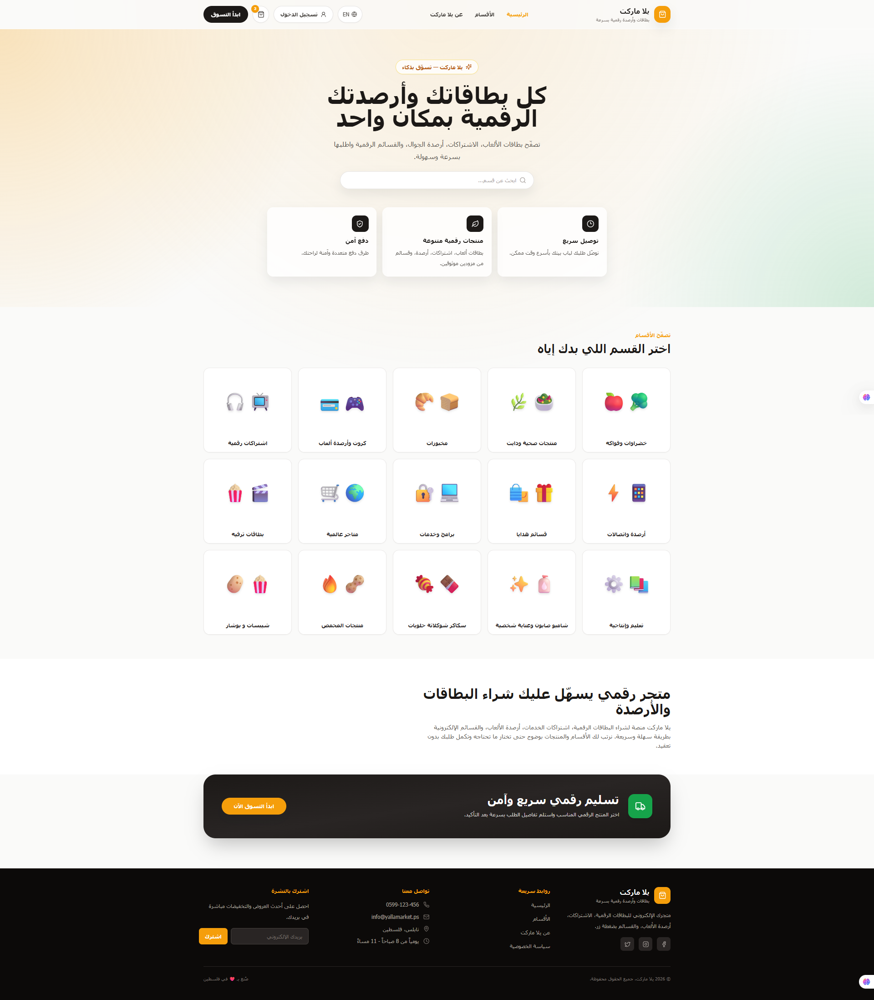
</p>

<p align="center">
  <strong>A bilingual full-stack marketplace built for the Software Engineering course at An-Najah National University.</strong>
</p>

<p align="center">
  
  
  
  
  
  
</p>

---

## Overview

**YallaMarket** is a bilingual Arabic/English marketplace web application that supports product browsing, category navigation, cart management, checkout flow, authentication, and admin management features.

The project was developed as part of a **Software Engineering** course using an Agile/Scrum process with Jira for project management and GitHub for version control. The system follows a three-layer architecture:

- **Presentation Layer:** React + Vite + Tailwind CSS
- **Application Layer:** Express.js REST API
- **Data Layer:** SQLite database

---

## Table of Contents

- [Features](#features)
- [Screenshots](#screenshots)
- [Technology Stack](#technology-stack)
- [System Architecture](#system-architecture)
- [Project Structure](#project-structure)
- [Getting Started](#getting-started)
- [Environment Variables](#environment-variables)
- [API Overview](#api-overview)
- [Database Design](#database-design)
- [UML & Design Documentation](#uml--design-documentation)
- [Quality Assurance](#quality-assurance)
- [Agile Project Management](#agile-project-management)
- [Version Control](#version-control)
- [Known Limitations](#known-limitations)
- [Team](#team)

---

## Features

### Customer Features

- Browse marketplace categories.
- View products by category.
- Search and filter products.
- View product details.
- Add products to cart.
- Update item quantity and remove items from cart.
- Persist cart items using `localStorage`.
- Complete checkout form and submit orders.
- Register and log in using JWT authentication.
- Switch between Arabic RTL and English LTR layouts.

### Admin Features

- Admin dashboard with system overview.
- Manage products.
- Manage categories.
- View and update orders.
- Protected admin routes using authentication and role checks.

### Engineering Features

- Modular frontend structure.
- Reusable React components.
- RESTful backend API.
- SQLite persistence.
- JWT-based protected routes.
- Manual QA documentation.
- Jira-based sprint and bug tracking.
- UML, ERD, and sequence diagrams.

---

## Screenshots

### Category & Product Browsing

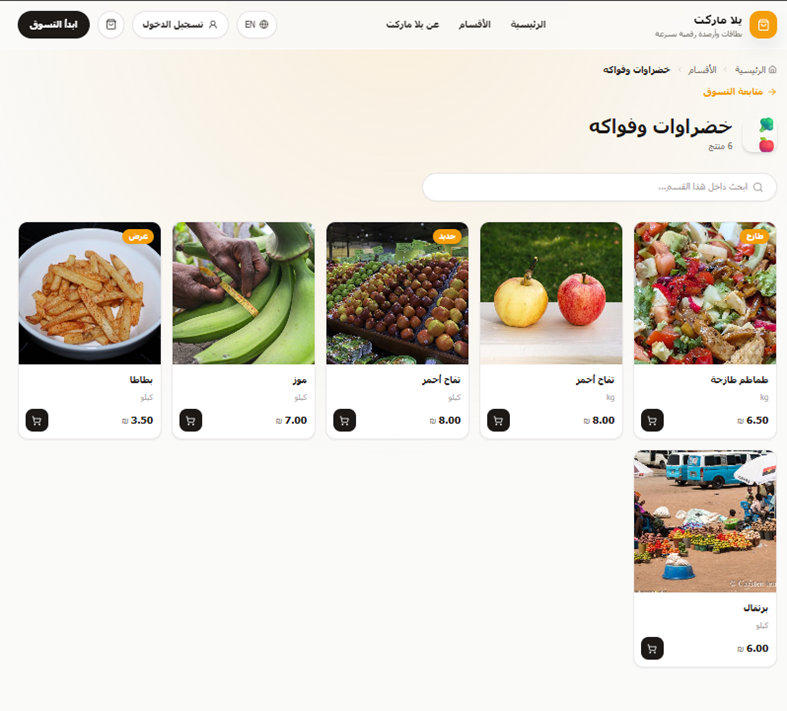

### Shopping Cart

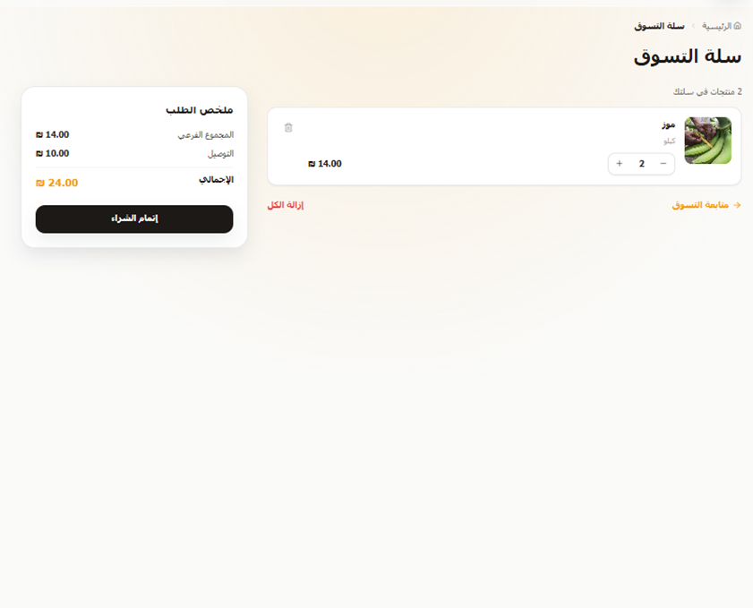

### Checkout Flow

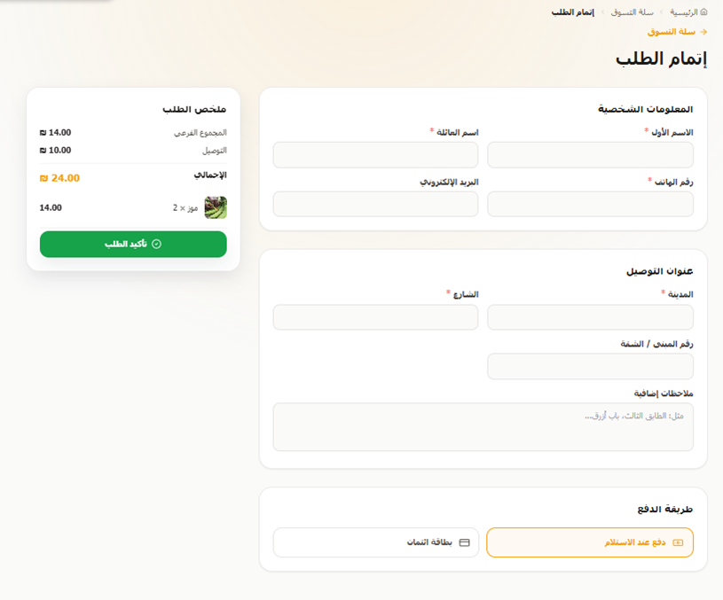

---

## Technology Stack

| Layer              | Technology   | Purpose                                  |
| ------------------ | ------------ | ---------------------------------------- |
| Frontend           | React        | UI components and state-driven rendering |
| Build Tool         | Vite         | Fast development and production build    |
| Styling            | Tailwind CSS | Responsive utility-first design          |
| Routing            | React Router | Client-side navigation                   |
| State Management   | Context API  | Cart, language, and authentication state |
| Backend            | Express.js   | REST API and server-side logic           |
| Database           | SQLite       | Lightweight relational persistence       |
| Authentication     | JWT + bcrypt | Secure login and password hashing        |
| Project Management | Jira         | Agile backlog, sprints, bugs, and tasks  |
| Version Control    | Git + GitHub | Collaboration and code history           |

---

## System Architecture

YallaMarket follows a layered architecture designed for maintainability and clear separation of concerns.

```text
React Client
  ├── Pages
  ├── Components
  ├── Contexts
  └── Services
        │
        ▼
Express.js REST API
  ├── Routes
  ├── Controllers
  ├── Middleware
  └── Validation / Business Logic
        │
        ▼
SQLite Database
  ├── Users
  ├── Categories
  ├── Products
  ├── Orders
  └── Order Items
```

---

## Project Structure

```text
yallaMarket/
├── client/
│   ├── src/
│   │   ├── components/
│   │   ├── contexts/
│   │   ├── pages/
│   │   ├── services/
│   │   └── main.jsx
│   ├── package.json
│   └── vite.config.js
│
├── server/
│   ├── src/
│   │   ├── config/
│   │   ├── controllers/
│   │   ├── middleware/
│   │   ├── routes/
│   │   ├── app.js
│   │   └── server.js
│   └── package.json
│
├── docs/
│   ├── SRS_Documents/
│   ├── Diagrams/
│   ├── Testing/
│   └── PowerPoint/
│
├── README.md
└── .gitignore
```

---

## Getting Started

### Prerequisites

Make sure you have installed:

- Node.js
- npm
- Git

A modern Node.js version is recommended because the backend uses SQLite-related functionality.

---

### 1. Clone the Repository

```bash
git clone https://github.com/BaraaMasri99/yallaMarket.git
cd yallaMarket
```

---

### 2. Install and Run the Backend

```bash
cd server
npm install
npm run dev
```

The backend should start on the configured port, commonly:

```text
http://localhost:5000
```

---

### 3. Install and Run the Frontend

Open a second terminal:

```bash
cd client
npm install
npm run dev
```

The frontend should start on:

```text
http://localhost:5173
```

---

## Environment Variables

Create a `.env` file inside the `server/` directory.

Example:

```env
PORT=5000
NODE_ENV=development
JWT_SECRET=replace_this_with_a_secure_secret
CLIENT_URL=http://localhost:5173
```

> Do not commit real secrets to GitHub. Use `.env.example` for shared configuration examples.

---

## API Overview

| Method   | Endpoint                     | Description                             | Auth Required |
| -------- | ---------------------------- | --------------------------------------- | ------------- |
| `GET`    | `/api/health`                | Check API health                        | No            |
| `POST`   | `/api/auth/register`         | Register a new user                     | No            |
| `POST`   | `/api/auth/login`            | Login and receive JWT                   | No            |
| `POST`   | `/api/auth/logout`           | Logout response / client token clearing | Optional      |
| `GET`    | `/api/categories`            | Get all categories                      | No            |
| `GET`    | `/api/categories/:id`        | Get category by ID                      | No            |
| `GET`    | `/api/categories/slug/:slug` | Get category by slug                    | No            |
| `POST`   | `/api/categories`            | Create category                         | Admin         |
| `PUT`    | `/api/categories/:id`        | Update category                         | Admin         |
| `DELETE` | `/api/categories/:id`        | Delete category                         | Admin         |
| `GET`    | `/api/products`              | List/search products                    | No            |
| `GET`    | `/api/products/:id`          | Get product details                     | No            |
| `GET`    | `/api/products/related/:id`  | Get related products                    | No            |
| `POST`   | `/api/products`              | Create product                          | Admin         |
| `PUT`    | `/api/products/:id`          | Update product                          | Admin         |
| `DELETE` | `/api/products/:id`          | Delete product                          | Admin         |
| `POST`   | `/api/orders`                | Submit checkout order                   | User          |
| `GET`    | `/api/orders/my`             | Get current user orders                 | User          |
| `GET`    | `/api/orders`                | Get all orders                          | Admin         |
| `GET`    | `/api/orders/:id`            | Get order details                       | Owner/Admin   |
| `PUT`    | `/api/orders/:id/status`     | Update order status                     | Admin         |
| `GET`    | `/api/admin/dashboard/stats` | Get dashboard statistics                | Admin         |

---

## Database Design

The database is implemented using SQLite and contains the main entities required by the marketplace workflow.

### Core Tables

- `users`
- `categories`
- `products`
- `orders`
- `order_items`
- `newsletter_subscribers`

### ERD

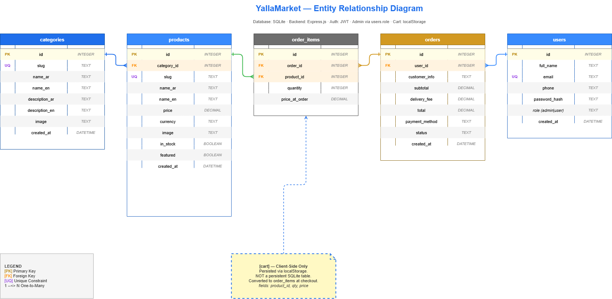

---

## UML & Design Documentation

### Use Case Diagram

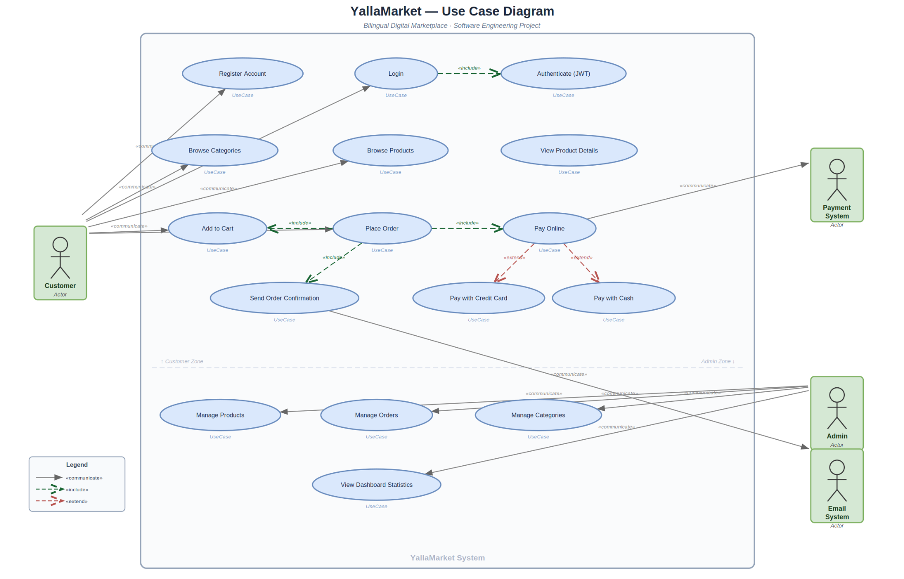

### Class Diagram

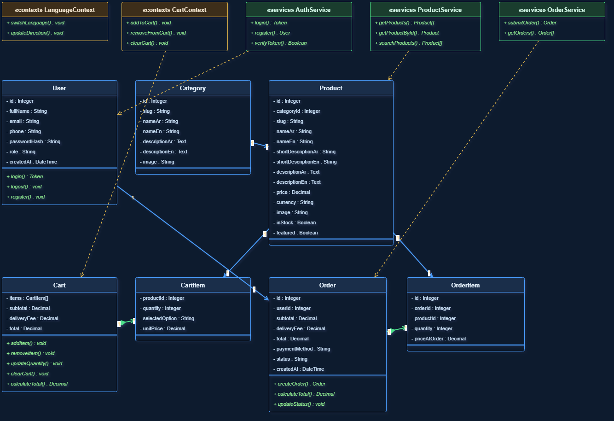

<details>
<summary><strong>Sequence Diagrams</strong></summary>

### Checkout Flow Sequence Diagram

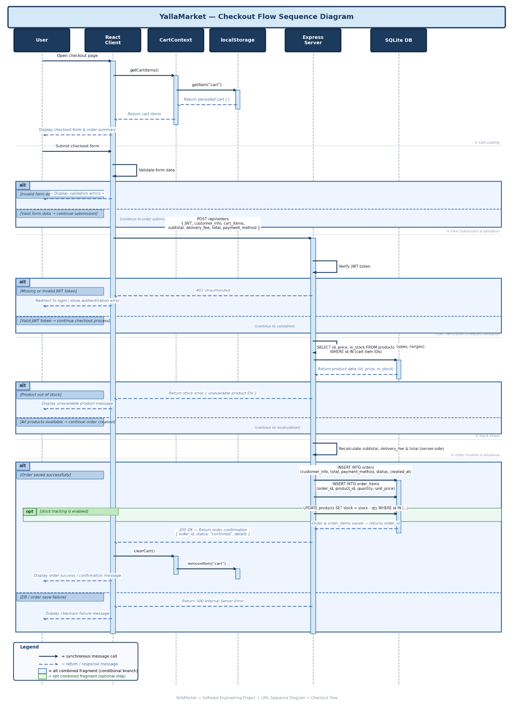

### Login / Logout Sequence Diagram

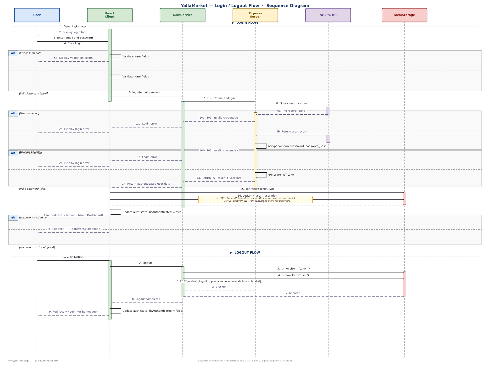

### Language Switch Sequence Diagram

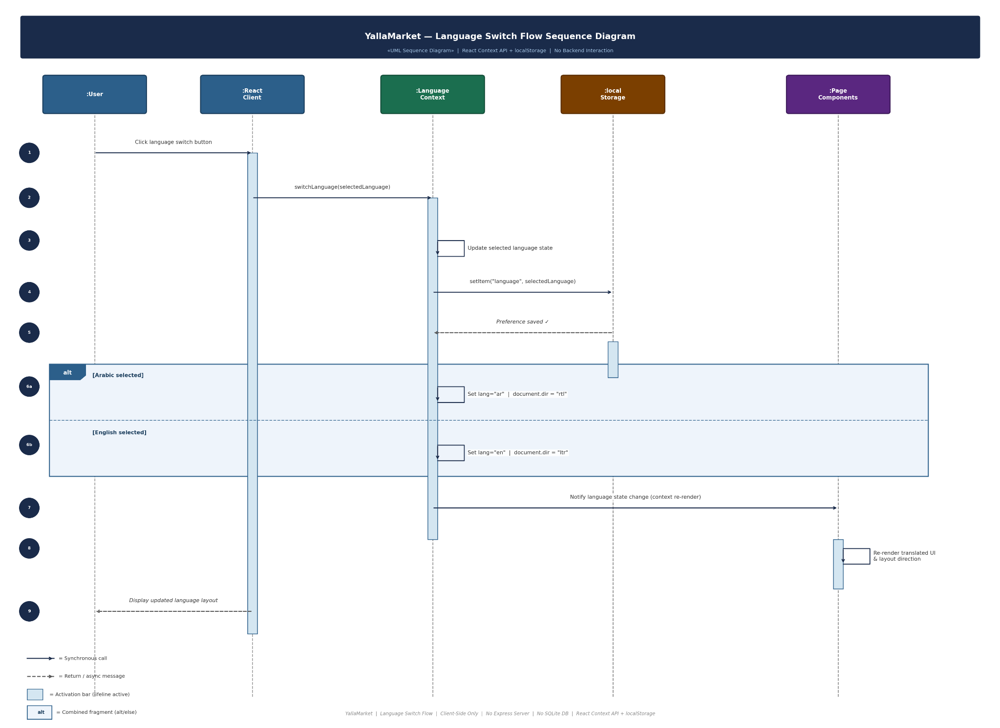

</details>

---

## Quality Assurance

The project includes manual QA documentation covering the most important user and admin workflows.

### Testing Scope

- Homepage and category browsing
- Product search and filtering
- Product details
- Cart operations
- Cart persistence
- Authentication
- Checkout and order submission
- Admin dashboard
- Admin product/category/order management
- RTL/LTR language switching
- Error and fallback behavior

### QA Summary

| Area               | Result    |
| ------------------ | --------- |
| Manual test cases  | Completed |
| Functional testing | Completed |
| UI testing         | Completed |
| Jira bug tracking  | Completed |
| Final QA sprint    | Completed |

### Resolved Final QA Bugs

| Jira Key    | Summary                                                        | Status |
| ----------- | -------------------------------------------------------------- | ------ |
| `SCRUM-127` | Cart total did not update immediately after quantity changes   | Done   |
| `SCRUM-128` | Checkout validation messages were unclear for incomplete forms | Done   |
| `SCRUM-129` | Language direction was inconsistent after switching languages  | Done   |
| `SCRUM-130` | Invalid product routes needed improved fallback handling       | Done   |

---

## Agile Project Management

The project followed an Agile/Scrum workflow using Jira.

### Agile Evidence

- Product backlog
- Multiple planned sprints
- Sprint completion tracking
- Final QA sprint
- Bug tracking
- GitHub-linked development issues
- Velocity report

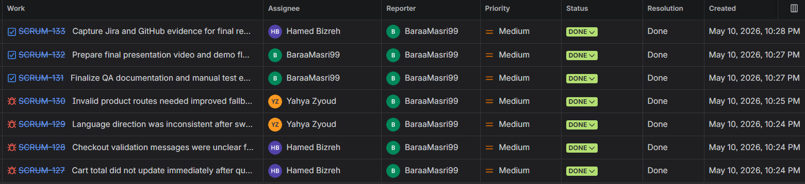

### Velocity Report

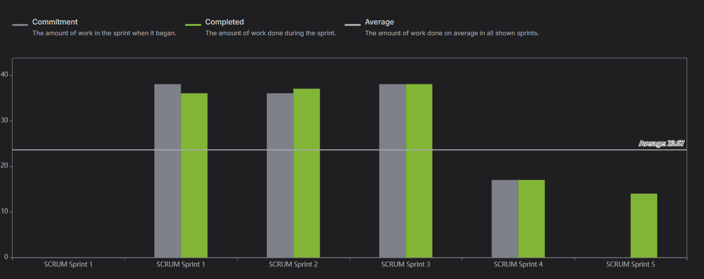

---

## Version Control

The project was managed using Git and GitHub.

Repository:

```text
https://github.com/BaraaMasri99/yallaMarket
```

### GitHub Evidence

- Main repository structure
- Commit history
- Branching and merging
- Jira-linked pull requests
- Collaborative workflow evidence

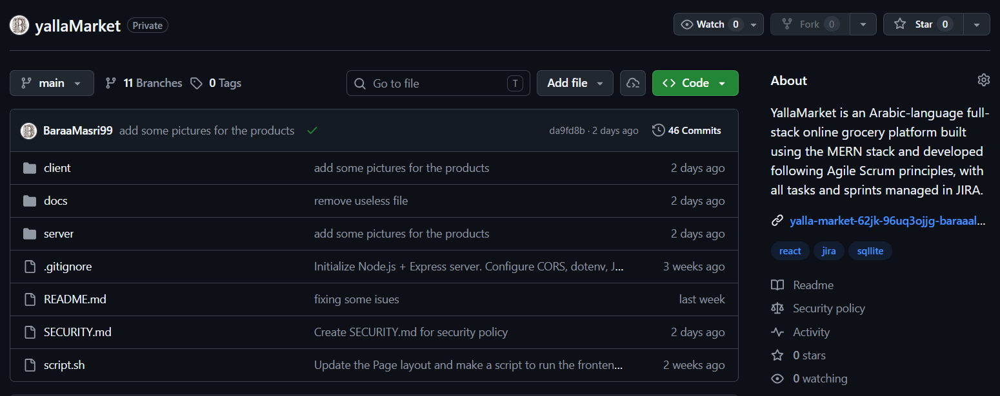

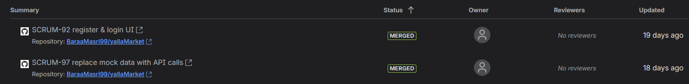

---

## Known Limitations

The current project version is suitable for academic submission and demonstration. Some limitations are intentionally documented for transparency:

- Real external payment gateway integration is not included; the checkout currently supports payment method selection.
- Logout is mainly handled through client-side token clearing.
- The project uses manual QA testing rather than automated test suites.
- Some production-level concerns such as hosting, monitoring, and advanced security hardening are considered future improvements.

---

## Future Enhancements

- Integrate a real payment gateway.
- Add automated unit and integration tests.
- Add user order history UI.
- Improve admin analytics and reporting.
- Add image upload support for products and categories.
- Improve deployment and production configuration.

---

## Team

| Name         | Role / Contribution                                           |
| ------------ | ------------------------------------------------------------- |
| Baraa Masri  | Scrum Master, frontend/backend, QA, Jira/GitHub documentation |
| Hamed Bizreh | Development, backend/API, diagrams, testing support           |
| Yahya Ziyoud | Development, database/API, diagrams, testing support          |

---

## Course Information

| Field      | Value                           |
| ---------- | ------------------------------- |
| Course     | Software Engineering            |
| Major      | Computer Science Apprenticeship |
| University | An-Najah National University    |
| Instructor | Dr. Firas Shakaa                |
| Semester   | Second Semester                 |

---

## License

This project was developed for academic purposes as part of a university Software Engineering course.
